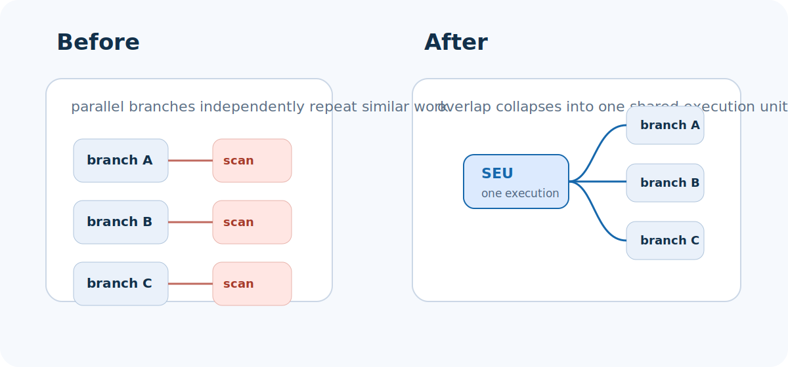
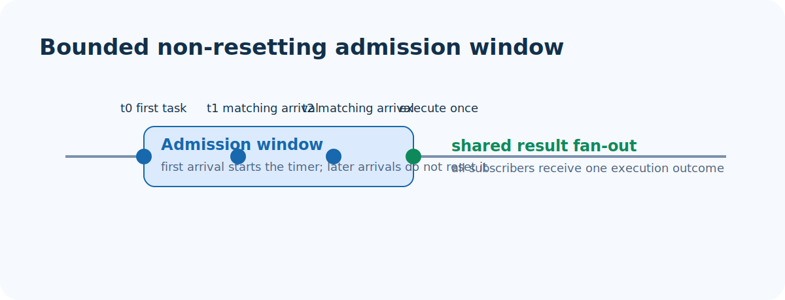
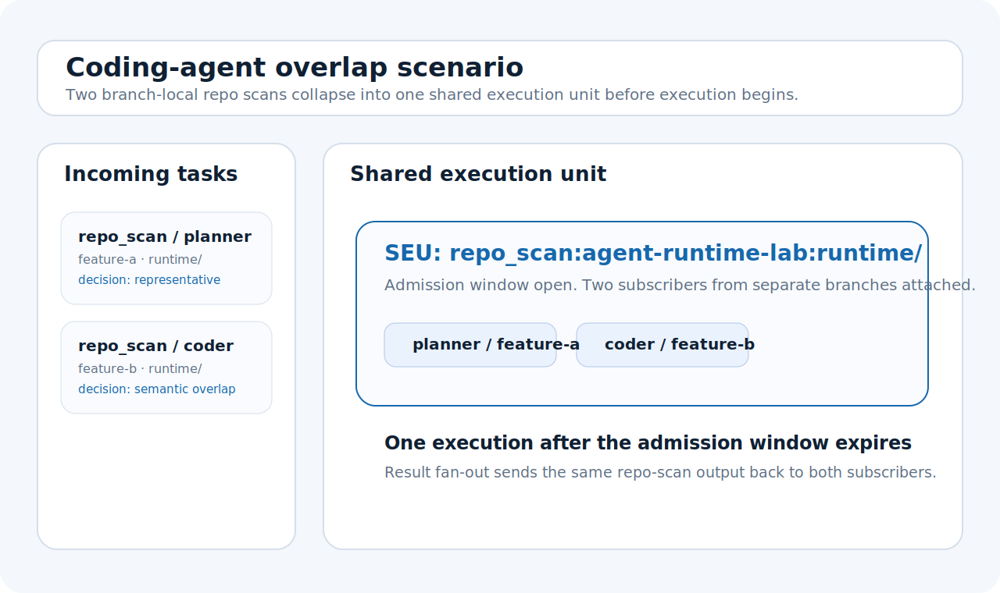
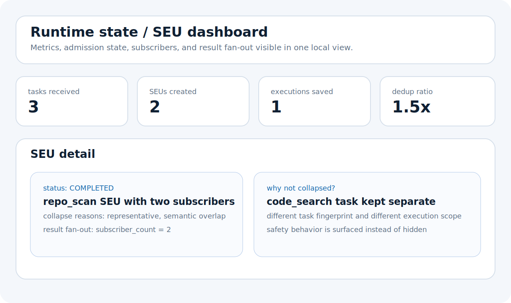
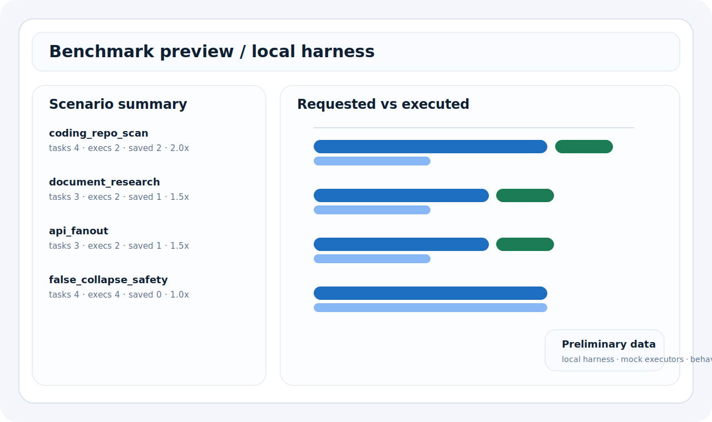
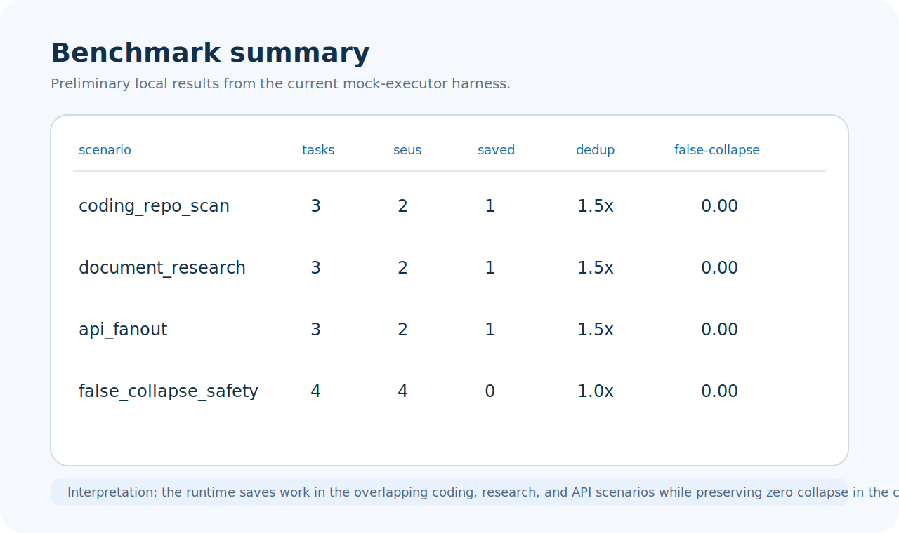

# gemma4-wdc

*Local multi-agent execution with middleware-level deduplication.*

gemma4-wdc is a laptop-first prototype of a local, offline multi-agent system where Gemma-family agents emit overlapping tool tasks and a WDC-style middleware runtime collapses duplicate backend work before execution.

The project explores a simple systems thesis: as local agentic workflows become practical, one of the next bottlenecks is duplicated downstream work across concurrent agents. gemma4-wdc demonstrates how shared SQL, API, document, and code-analysis tasks can be detected, collapsed into shared execution units, and fanned out across agents on consumer hardware.



## What It Does

- Multiple local or simulated agents emit tool tasks independently.
- Middleware detects semantic overlap across those tasks.
- A bounded admission window captures duplicate work before execution.
- One shared execution serves multiple subscribers.
- Dashboard and benchmarks make the savings visible.

**Quick links**

- [Live Site](https://manishklach.github.io/gemma4-wdc/)
- [Architecture](./docs/architecture.md)
- [Benchmarks](./benchmarks/README.md)
- [Run Locally](#run-locally)

## Architecture Preview

gemma4-wdc presents a local multi-agent runtime centered on middleware-level deduplication: task ingress, semantic overlap detection, bounded admission, shared execution units, and result fan-out.

It is most relevant to coding-agent and research-agent workflows where overlapping repo scans, document extraction, API calls, and analytics tasks become a runtime bottleneck.

## Why This Exists

Local multi-agent systems are getting easier to run. Even on modest hardware, we can already simulate or partially realize agent teams that branch, plan, search, inspect code, extract evidence, and call tools in parallel.

What still gets wasted is the backend work underneath those branches. Multiple locally rational agents can independently ask for the same repo scan, the same document extraction pass, or the same analytics query. Gemma4-WDC exists to demonstrate that this is a middleware problem as much as a model problem.

## Current Scope

This repository is intentionally scoped as:

- a single-machine proof of concept
- simulation-first by default
- practical on a modest Windows laptop or Windows plus WSL2 setup
- optionally able to host one real local model adapter in hybrid mode

It is explicitly not:

- a production cluster
- a polished enterprise control plane
- a proof of 10-node throughput
- a claim that many heavy local model instances should run concurrently on consumer hardware

Simulation mode is first-class. Hybrid mode with one real local model is optional. The repository is designed to demonstrate the systems thesis on consumer hardware, not to present a production multi-node cluster.

## Key Properties

gemma4-wdc receives structured tool tasks from multiple agents or branches:

1. a task ingress layer records the task, agent, branch, type, and resource hint
2. a fingerprinting layer computes a canonical key, exact structural hash, and semantic comparison text
3. matching first tries exact structural overlap, then lightweight near-duplicate similarity where safe
4. the first arrival opens a bounded admission window that does not reset
5. matching tasks attach to one shared execution unit, or SEU
6. the SEU executes once through the backend executor
7. the result fans out to all subscribing agents
8. metrics show tasks received, SEUs created, executions saved, dedup multiplier, and safety rejections

```text
multi-agent tasks
  -> ingress registry
  -> semantic fingerprinting
  -> bounded admission window
  -> shared execution unit
  -> execute once
  -> result fan-out
  -> observability
```



## Demo Scenarios

- `SQL overlap demo`
  Multiple agents ask materially similar analytics questions and one execution serves several branches.
- `API overlap demo`
  Similar backend requests collapse into one shared execution path.
- `Document research demo`
  Research agents extract overlapping evidence from the same corpus.
- `Coding-agent demo`
  Parallel planner, coder, and reviewer branches inspect the same local repo and collapse overlapping repo-understanding work.
- `Unique-task counterexample`
  Similar-looking tasks stay separate when correctness should win over aggressive collapse.

Screenshot assets:





## Laptop-First Operation

Simulation mode is the default and the primary deliverable.

- multiple agents are simulated with structured task templates and lightweight local logic
- the runtime behaves like a local multi-agent middleware service
- the dashboard stays useful even without a real local model attached
- demo scenarios and benchmarks are designed to be credible in this mode

This is the mode that should make a reader believe the systems thesis.

## Hybrid Mode

Hybrid mode keeps most agents simulated while allowing one optional real local model adapter to participate.

- one local Gemma-compatible node can propose tasks or rewrite them into structured tool calls
- the remaining agents stay lightweight so the demo remains laptop-friendly
- the middleware, not the model count, remains the focus

If no real model is available, the project is still complete in simulation mode.

## Run Locally

### Simulation Mode

```bash
cd runtime/shared_execution/backend
python -m venv .venv
.venv\Scripts\activate
pip install -r requirements.txt
uvicorn app.main:app --reload
```

In a second terminal:

```bash
cd runtime/shared_execution/frontend
python -m http.server 4173
```

Then open `http://localhost:4173` and run the built-in demo scenarios.

### Hybrid Mode

Hybrid mode currently means: run the same stack, but wire one local model adapter into the task-generation path while keeping the rest of the agents simulated.

For now, the repository includes the interface and positioning for this mode, but a stronger real-model path is still a next-step item rather than a polished default experience.

## Benchmarks

These numbers are preliminary and come from the current local harness using mock executors and hand-authored scenarios. They are here to show runtime behavior clearly, not to overclaim production performance.

| Scenario | Tasks Requested | Actual Executions | Executions Saved | Dedup Ratio | False-Collapse Rate |
| --- | ---: | ---: | ---: | ---: | ---: |
| `coding_repo_scan` | 4 | 2 | 2 | 2.0x | 0.00 |
| `document_research` | 3 | 2 | 1 | 1.5x | 0.00 |
| `api_fanout` | 3 | 2 | 1 | 1.5x | 0.00 |
| `false_collapse_safety` | 4 | 4 | 0 | 1.0x | 0.00 |



See [docs/benchmark-methodology.md](./docs/benchmark-methodology.md) and [benchmarks/README.md](./benchmarks/README.md) for detail.

### Benchmark Harness

```bash
cd benchmarks
python run_benchmarks.py
```

Outputs:

- machine-readable summary: [benchmarks/results/latest_summary.json](./benchmarks/results/latest_summary.json)
- readable summary: [benchmarks/results/summary.md](./benchmarks/results/summary.md)

### GitHub Pages Site

The public microsite is rooted at [`site/`](./site) and includes:

- a Pages-safe static asset tree
- architecture, benchmark, and example pages
- canonical URLs, Open Graph metadata, `robots.txt`, `sitemap.xml`, and a custom `404.html`
- a deploy workflow at [`.github/workflows/pages.yml`](./.github/workflows/pages.yml)

To preview locally:

```bash
cd site
python -m http.server 8080
```

Then open `http://localhost:8080`.

## Repo Structure

```text
agent-runtime-lab/
  README.md
  docs/
  diagrams/
  benchmarks/
  examples/
  runtime/shared_execution/
  site/
```

Key entry points:

- [runtime/shared_execution/backend/app/core/runtime.py](./runtime/shared_execution/backend/app/core/runtime.py)
- [runtime/shared_execution/backend/app/api/scenarios.py](./runtime/shared_execution/backend/app/api/scenarios.py)
- [runtime/shared_execution/frontend/index.html](./runtime/shared_execution/frontend/index.html)
- [examples/coding_agents_demo/README.md](./examples/coding_agents_demo/README.md)
- [site/index.html](./site/index.html)

## Roadmap

- stronger local model adapter path for one real Gemma-family node
- branch-aware intermediate state reuse beyond full result fan-out
- richer coding-agent traces and replayable scenario logs
- stronger explainability for why tasks did or did not collapse
- eventual multi-node coordination after the single-machine thesis is fully proven

See [docs/roadmap.md](./docs/roadmap.md) for the longer plan.

## Limits

- in-memory single-process runtime
- mock or lightweight local backends
- hand-authored scenarios instead of replayed production traces
- no distributed coordination yet
- hybrid mode is real as a concept, but the simulation-first path is still the best experience
