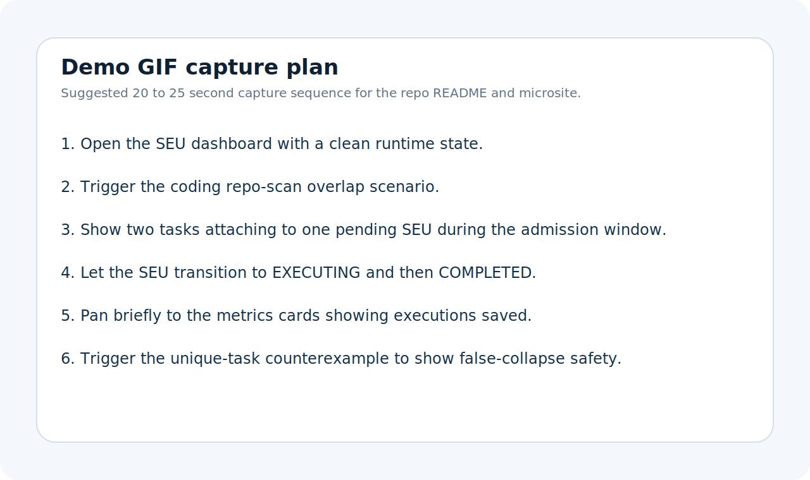

# Agent Runtime Lab

Shared execution and semantic subtask deduplication for concurrent agent systems.

Modern agent systems increasingly branch. Coding agents split into parallel repo-understanding passes, research agents fork evidence gathering, and tool-using runtimes launch overlapping work from neighboring trajectories. Most stacks still lack a runtime layer that detects that overlap before the work is already in flight.

Agent Runtime Lab explores one concrete systems answer to that bottleneck. Its first flagship module, Shared Execution Runtime, detects semantic overlap across incoming tasks, holds the first arrival in a bounded non-resetting admission window, collapses matching work into a shared execution unit, executes once, fans out the result, and measures the savings.


## Why This Exists

Concurrent branch execution changes the cost profile of agent systems. Once planners, coding agents, and research agents begin operating in parallel, duplication stops looking like a prompt problem and starts looking like a runtime problem.

Existing stacks often have memoization, caching, or queue-level batching, but they usually miss the middle ground that matters for agent workloads:

- requests are not byte-identical
- overlap shows up before execution, not after
- correctness matters more than aggressive collapse
- engineers need to understand why work did or did not merge

This repository is a prototype for that missing runtime layer.

## Key Properties

- semantic subtask matching
- task fingerprints with exact structural hash plus optional near-duplicate similarity
- bounded non-resetting admission window
- shared execution units (SEUs)
- result fan-out to all subscribers
- runtime observability and benchmark artifacts
- false-collapse safety scenarios

## What The Runtime Does

Shared Execution Runtime accepts typed tasks such as `repo_scan`, `code_search`, `test_run`, `doc_extract`, `api_call`, `sql_query`, and `nl_research_task`.

For each task, the runtime:

1. computes a task fingerprint
2. searches pending candidate SEUs in the same resource scope
3. prefers exact structural matches and only then considers semantic overlap
4. attaches matching tasks as subscribers during the admission window
5. executes the SEU once when the window expires
6. stores the result and fans it out to every subscriber
7. emits metrics for tasks received, SEUs created, executions saved, and safety rejections

## Why This Matters For Coding Agents And Multi-Agent Systems

The coding-agent angle is central here, not incidental. In branch-heavy coding workflows, multiple agents often re-run overlapping repo scans, dependency tracing, code search, or test-planning passes against the same codebase slice. They do this because each branch is locally rational, even when the total runtime is globally wasteful.

Shared execution is a plausible runtime primitive for:

- repo-understanding agents asking near-identical structural questions
- code-search agents revisiting the same symbols or paths from different branches
- multi-branch debugging and refactoring flows
- repeated test execution planning against overlapping scopes
- research/document-processing branches extracting similar evidence from the same corpus

## How It Works

```text
semantic overlap
  -> bounded admission window
  -> shared execution unit (SEU)
  -> execute once
  -> result fan-out
  -> observable savings
```


## Demo Scenarios

The local UI is built to make the runtime value legible quickly:

- SQL duplicate scenario
- NL duplicate scenario
- coding repo-scan overlap scenario
- unique-task counterexample

Screenshot assets:


Demo GIF plan placeholder:



## Benchmark Highlights

These numbers are preliminary and come from the current local harness using mock executors and hand-authored scenarios. They are included to show behavior clearly, not to claim production-grade wins.

| Scenario | Tasks Received | SEUs Created | Executions Saved | Dedup Ratio | False-Collapse Rate |
| --- | ---: | ---: | ---: | ---: | ---: |
| `coding_repo_scan` | 3 | 2 | 1 | 1.5x | 0.00 |
| `document_research` | 3 | 2 | 1 | 1.5x | 0.00 |
| `api_fanout` | 3 | 2 | 1 | 1.5x | 0.00 |
| `false_collapse_safety` | 4 | 4 | 0 | 1.0x | 0.00 |


Benchmark details: [docs/benchmark-methodology.md](./docs/benchmark-methodology.md) and [benchmarks/README.md](./benchmarks/README.md)

## Run Locally

### Backend

```bash
cd runtime/shared_execution/backend
python -m venv .venv
.venv\Scripts\activate
pip install -r requirements.txt
uvicorn app.main:app --reload
```

### Frontend

```bash
cd runtime/shared_execution/frontend
python -m http.server 4173
```

Then open `http://localhost:4173`.

### Benchmarks

```bash
cd benchmarks
python run_benchmarks.py
```

The latest summary is written to [benchmarks/results/latest_summary.json](./benchmarks/results/latest_summary.json) and a readable artifact is stored at [benchmarks/results/summary.md](./benchmarks/results/summary.md).

## Repository Structure

```text
agent-runtime-lab/
  README.md
  docs/
  diagrams/
  benchmarks/
  examples/
  runtime/shared_execution/
  site/
```

Key entry points:

- [runtime/shared_execution/backend/app/core/runtime.py](./runtime/shared_execution/backend/app/core/runtime.py)
- [runtime/shared_execution/frontend/index.html](./runtime/shared_execution/frontend/index.html)
- [examples/coding_agents_demo/README.md](./examples/coding_agents_demo/README.md)
- [site/index.html](./site/index.html)

## Trust Signals And Limitations

This repository is prototype-quality and local/demo oriented. It is designed to make the runtime thesis concrete, not to present a production-ready distributed system.

Current limitations:

- in-memory single-process runtime
- mock executors rather than live tool backends
- hand-authored benchmark scenarios rather than replayed production traces
- no distributed coordination, persistence, or streaming fan-out transport

What this does not solve:

- planner quality
- tool correctness
- long-horizon agent memory reuse
- branch scheduling policy
- global consistency across distributed workers

## Roadmap

- near-term: explainable collapse decisions, stronger benchmark artifacts, richer coding-agent scenarios
- mid-term: distributed coordination, branch-aware intermediate state reuse, verifier hooks for coding agents
- longer-term: trajectory replay, state reuse across long-horizon runs, execution-aware branch scheduling

See [docs/roadmap.md](./docs/roadmap.md) for the longer plan.
